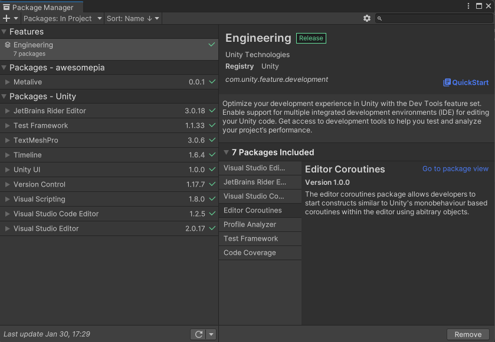
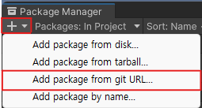
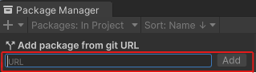

# MetaliveUnitySDK

## Install Git Url
Path = `https://github.com/PhantomUniversal/ExpandSDK.git?path=SDK/Assets/Phantom`

#### How to install package
1. Open unity package Manager`Unity/Window/PackageManager`

>

2. Select `+` and `Add package from git URL...`

>

3. Input text package url path

>